# Chương 3: Kết nối Intranet và Internet
## Bài 1: Thiết lập mạng Intranet nội bộ

### Bước 1: Cấu hình mạng cho các trạm kết nối vào cùng một mạng LAN
-----

- Bước 1-1: Vào phần `settings/network` của virtual box và thêm 2 card mạng.
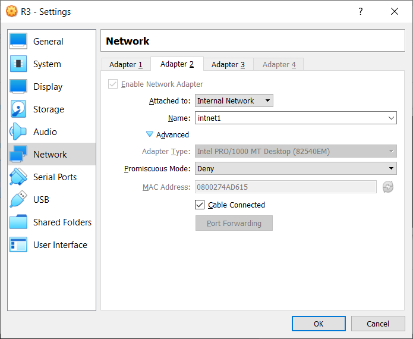

- Bước 1-2: Khởi động 3 máy ảo.

- Bước 1-3: Kiểm tra địa chỉ MAC của các card mạng xem có trùng với setup của virtual box không bằng cách dùng lệnh `ifconfig -a`. Nếu không thấy trùng thì edit file config của card mạng đó bằng lệnh `vi /etc/sysconfig/network-scripts/ifcfg-eth{X}`, trong đó {X} là số của card mạng cần chỉnh sửa thông số. Trong màn hình của vi editor, bấm `i` để vào insert mode và chỉnh sửa, sau khi chỉnh sửa xong thì bấm `esc` để thoát insert mode và gõ `:x` và enter để save file.
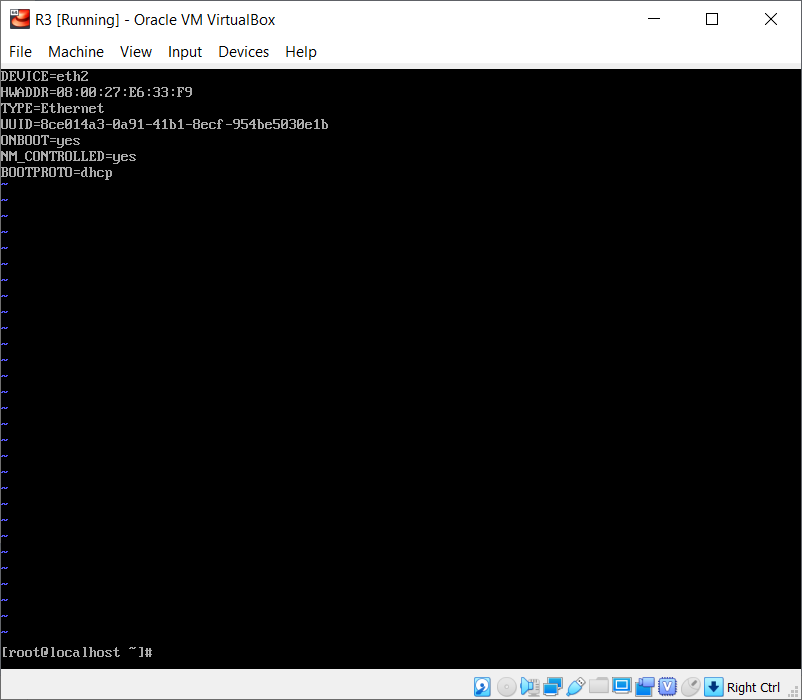

- Bước 1-4: Chỉnh IP address của các card mạng ở các máy bằng lệnh `ipconfig {tên card mạng} {địa chỉ IP}`. Ở đây ta setup eth1 ở R1 là 192.168.2.1, eth1 ở R2 là 192.168.2.2, eth1 ở R3 là 192.168.2.3.
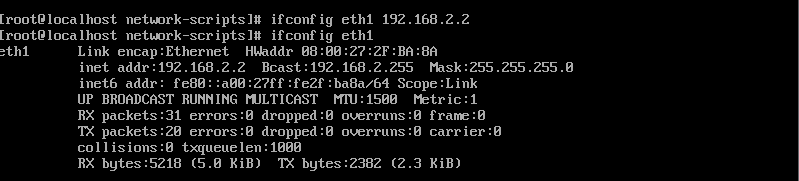

- Bước 1-5: ping thử các máy tới nhau. Ở đây ta thử ping từ R2 đến R3 và R1 bằng lệnh `ping {IP address}`
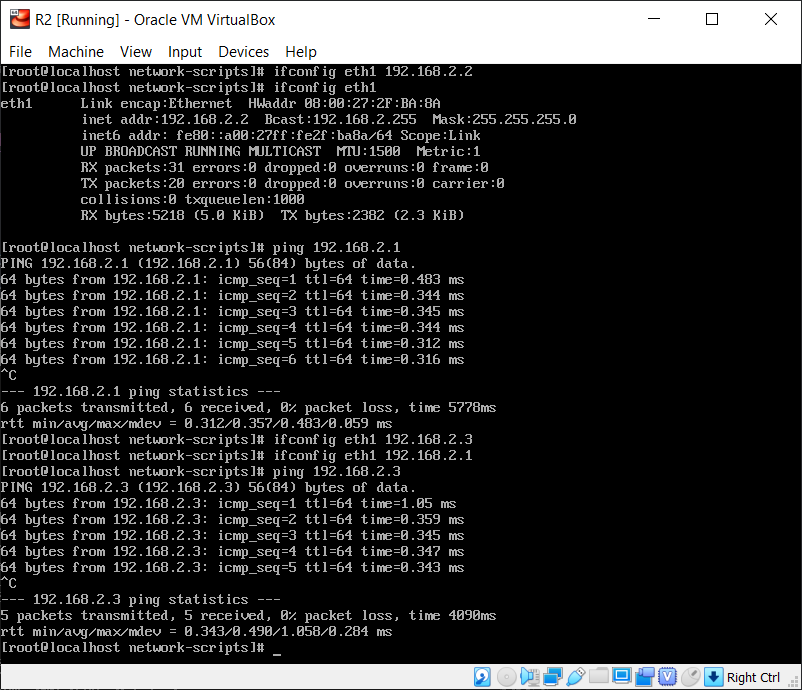

### Bước 2: Kết nối giữa hai trạm bằng lệnh ping và phân tích gói tin
-----
- Bước 2-1: Ở máy R1, chèn các luật để bắt và hiển thị gói tin prerouting & postrouting
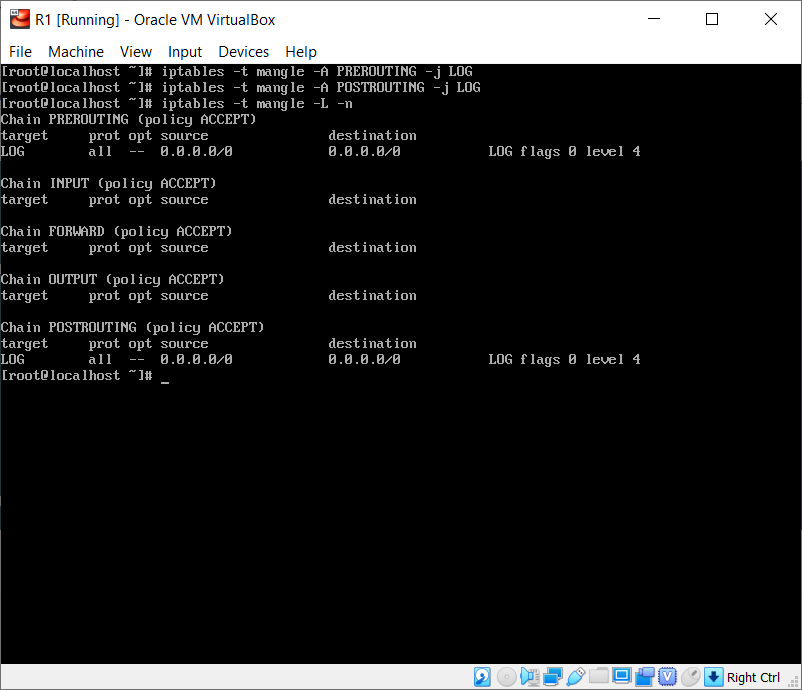

- Bước 2-2: Khởi động iptables
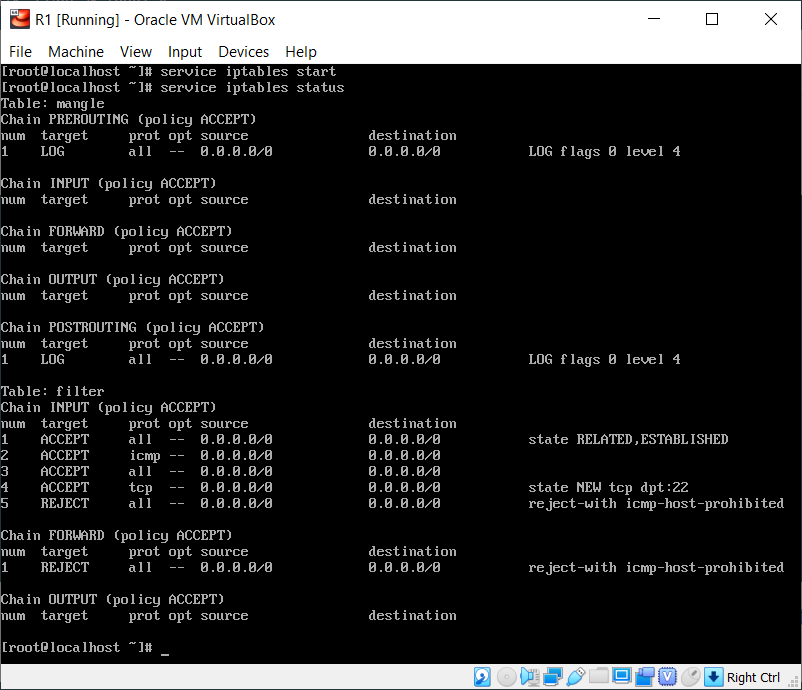

- Bước 2-3: Ở R2, thực hiện ping đến địa chỉ broadcast 192.168.2.0 bằng lệnh `ping 192.168.2.0 -b`.

- Bước 2-4: Ở R1, sử dụng lệnh `tail -f /var/log/messages | grep ICMP`. Do mỗi gói tin được ghi lại theo 1 dòng trong file log nên có thể dùng tail kết hợp với grep để lọc chỉ hiển thị các dòng thông tin có chứa từ khóa ICMP:
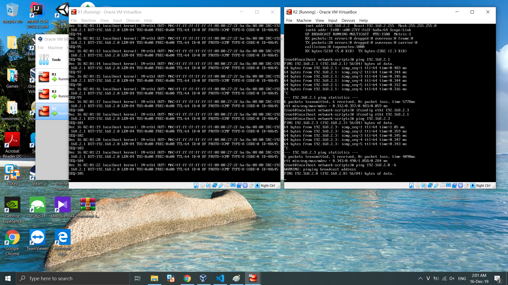
-----
## Bài 2: Làm việc với DHCP
### Bước 1: cài đặt & cấu hình DHCP server
-----
- Bước 1-1: Ở R1, cài đặt DHCP server bằng lệnh `yum install dhcp`

- Bước 1-2: Đặt lại tên card mạng được DHCP sử dụng ở file `/etc/sysconfig/dhcpd`. Ở đây ta dùng interface eth1.
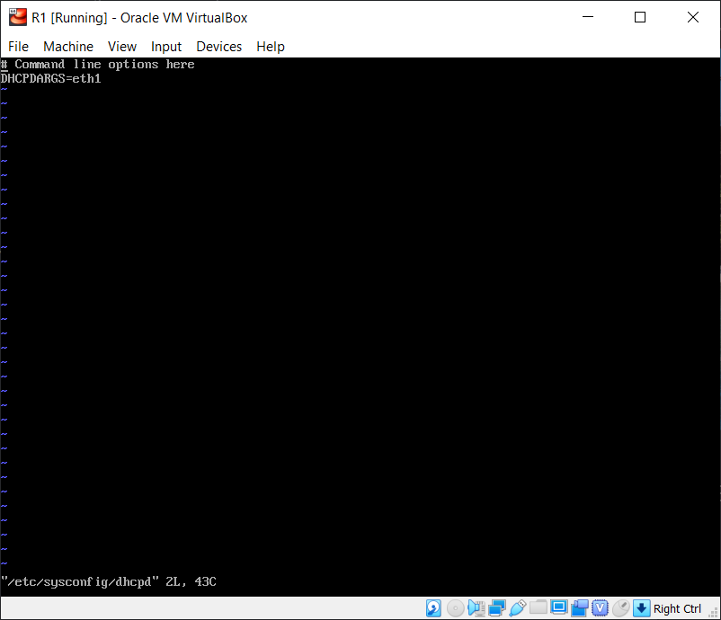

- Bước 1-3: Sửa file config của DHCP ở `/etc/dhcp/dhcpd.conf`. 2 tham số netmask và option routers phải trùng với netmask và IP address của card mạng được sử dụng. Ở đây netmask = `255.255.255.0` và option routers = `192.168.2.1` thì IP address của eth1 phải là `192.168.2.1/24`.
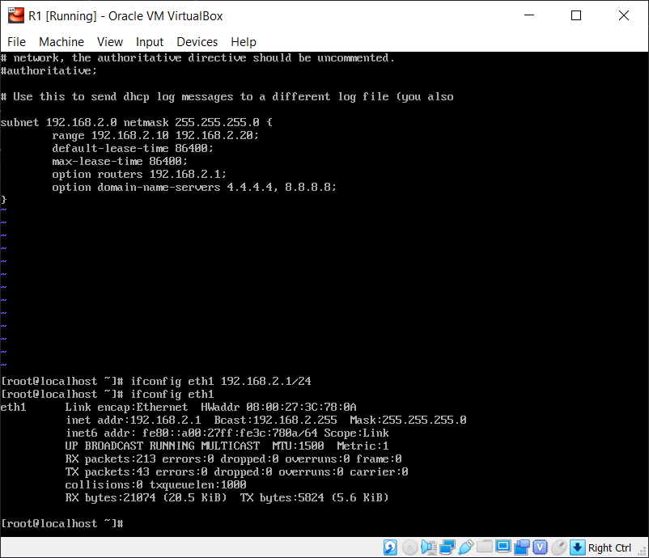

### Bước 2: thiết lập DHCP client
-----
- Bước 2-1: Trên Windows, cấu hình địa chỉ IP động chỉ IP động thông qua các cửa sổ thiết lập cấu hình IP cho từng kết nối mạng. Vào `Control Panel/Network Connections/` và edit properties dành cho virtual box:
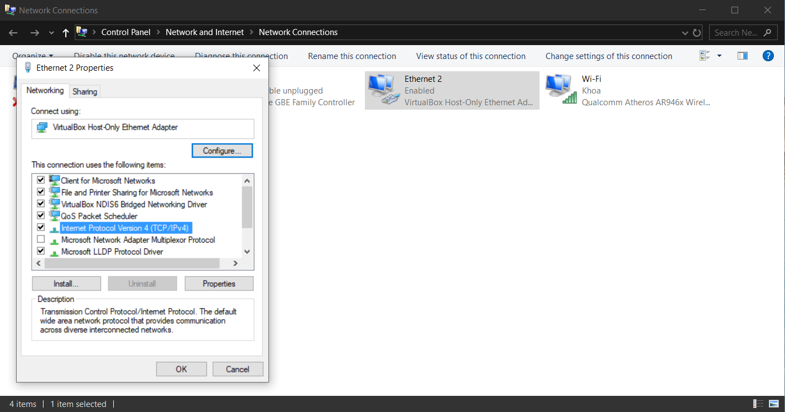

- Bước 2-2: chọn `properties` của IPv4 và chỉnh chế độ thành nhận IP và DNS server tự động:
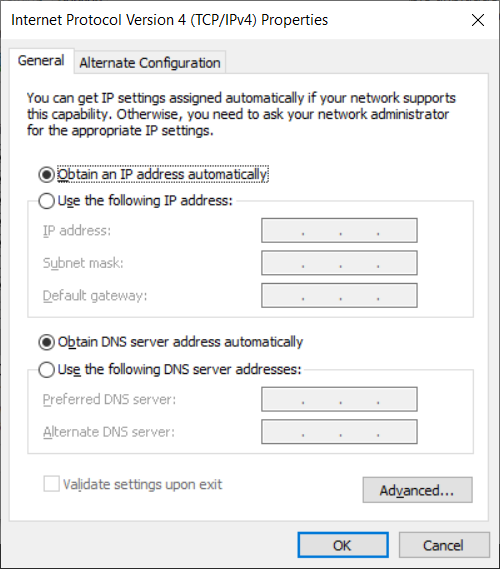

- Buớc 2-3: Ở R2, kiểm tra cấu hình của card mạng sử dụng, ở đây là eth1:
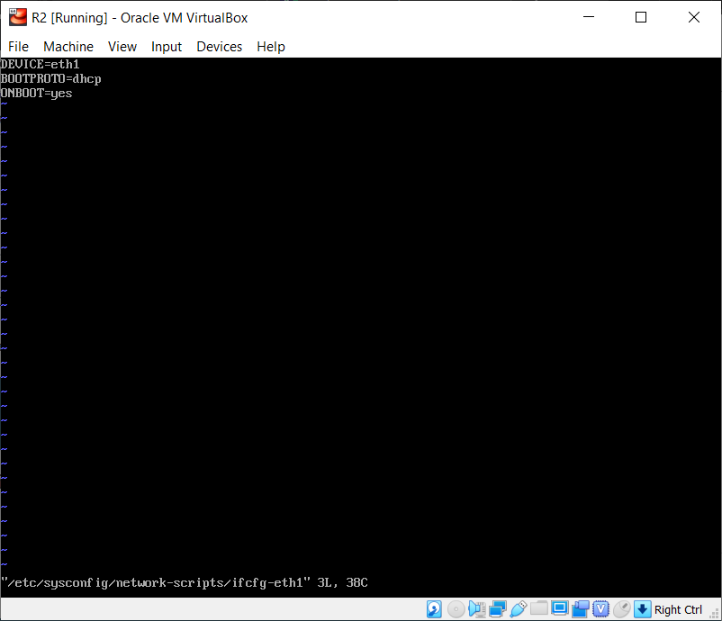
Với cấu hình như trên, khi khởi động trạm làm việc, card mạng eth1 sẽ tự động thực hiện giao thức DHCP để tìm kiếm DHCP server trên mạng và xin cấp địa chỉ IP.

### Bước 3: Tương tác DHCP client-server
-----
- Bước 3-1: Khởi động service DHCP trên máy chủ R1 bằng lệnh `service dhcpd restart`:
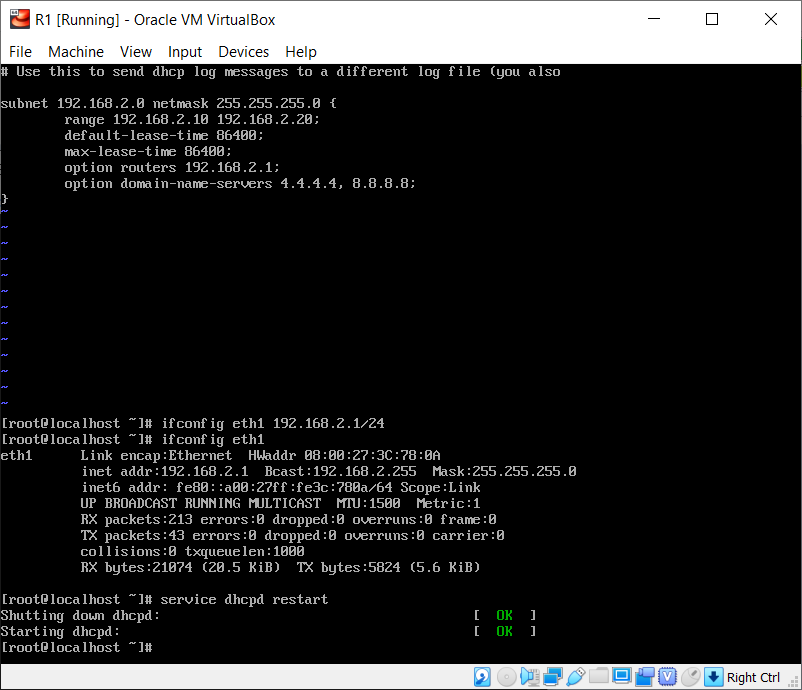

- Bước 3-2: Ở máy R2, giải phóng địa chỉ IP ở eth1 bằng lệnh `dhclient -r eth1`, sau đó sử dụng lệnh `dhclient -v eth1` để yêu cầu thiết lập lại địa chỉ IP và lại dùng `ifconfig eth1` để xem cấu hình card mạng với địa chỉ IP vừa được gán.

- Bước 3-3: Ở máy R1, bắt và phân tích gói tin bằng lệnh `tail -f /var/log/messages | grep DHCP`. Thực hiện chạy DHCP server và tiến hành giải phóng địa chỉ IP (dhclient -r) rồi cấp lại IP (dhclient -v) ở máy client như trên:
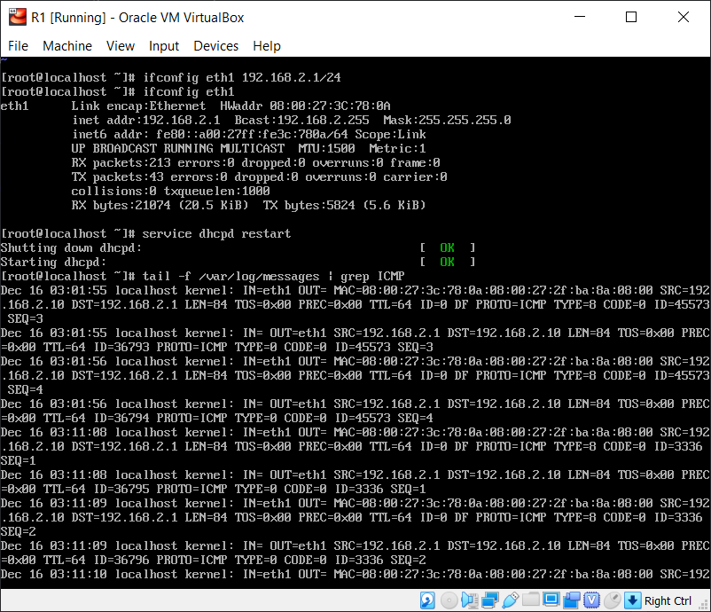

### Bước 4: Kịch bản tương tranh nhiều DHCP server
-----
- Bước 4-1: Cấu hình máy R3 làm DHCP server giống như các bước từ 1 đến 3, tuy nhiên với dải địa chỉ và IP khác:
 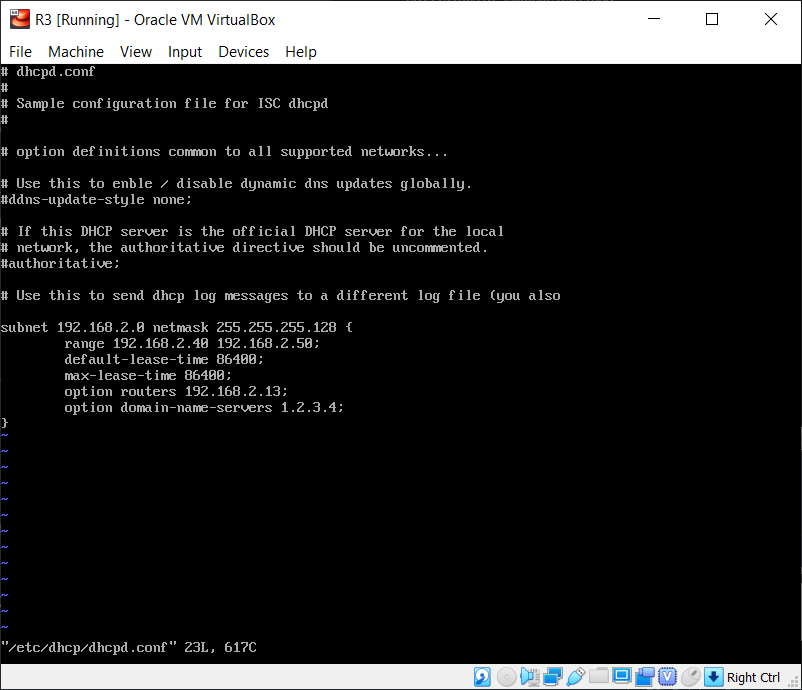

- Bước 4-2: Thực hiện giải phóng rồi cấp lại địa chỉ IP trên máy R2. Lúc này ta thấy máy R2 được cấp địa chỉ IP thuộc dải của máy R3 chứ không phải của R1:
 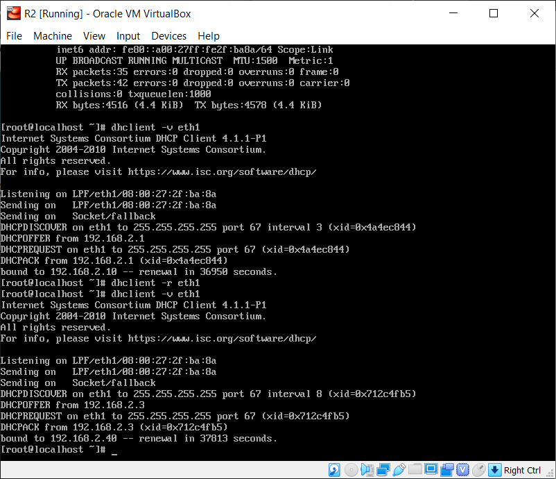
